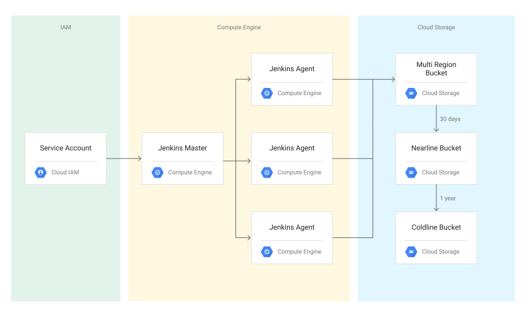

# Jenkin CASC and GCE slave

## Architecture



## Objectives
- Create a base image with Packer for running your Jenkins builds.
- Provision Jenkins using Cloud Marketplace.
- Configure Jenkins to deploy ephemeral build agents.

## Startup script

```
$ docker-compose up -d
```

## Plugin References

casc: https://github.com/jenkinsci/configuration-as-code-plugin/blob/master/README.md

google-compute-engine: https://github.com/jenkinsci/google-compute-engine-plugin
